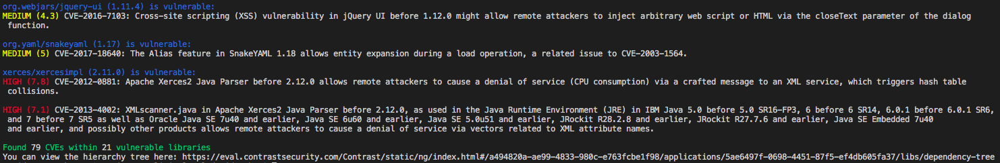

## Contrast CLI Wrapper

This utility is a wrapper for the contrast-cli tool which is documented here: https://docs.contrastsecurity.com/en/contrast-cli.html

It is intended to be used by developers to display vulnerability information for a local project from the command line:



## Usage

The script is intended to be a drop-in extension of the contrast-cli tool. At present it only supports a subset of parameters:

```sh
./contrast-sca.sh  --cli_api_key <YourAPIKey> \
 --cli_authorization <YourAuthorizationKey> \
 --cli_organization_id <YourOrganizationID> \
 --cli_host <YourHost, e.g. eval.contrastsecurity.com> \
 --cli_application_name <YourApplicationName> \
 --cli_application_id <YourApplicationId, optional> \
 --cli_language <JAVA, DOTNET, NODE, PYTHON OR RUBY> \
 --cli_project_path <Relative path to the App>
```

The script will perform the following actions:

1. Run the contrast-cli tool to attempt to create the application (if it already exists then it will collect the existing application's Id).
1. Run the contrast-cli tool to upload libraries for the current working folder (where the script resides).
1. Fetch the libraries back from the Contrast API.
1. Send the libraries to the API for analysis.
1. Detail the results in the command line.

### Prerequisites

This utility uses the jq library and has been tested with version 1.6.
* jq
```sh
brew install jq
```

### Installation

1. Ensure you are able to run the contrast-cli tool successfully before attempting to use this script.


## Roadmap

Please note that the current contrast-cli tool is being extended to provide this functionality. This script should be considered as a temporary extension only or may be used in scenarios where custom functionality is desired.


## Disclaimer

Please note: all tools/ scripts in this repo are released for use "AS IS" **without any warranties of any kind**,
including, but not limited to their installation, use, or performance.  We disclaim any and all warranties, either 
express or implied, including but not limited to any warranty of noninfringement, merchantability, and/ or fitness 
for a particular purpose.  We do not warrant that the technology will meet your requirements, that the operation 
thereof will be uninterrupted or error-free, or that any errors will be corrected.

Any use of these scripts and tools is **at your own risk**.  There is no guarantee that they have been through 
thorough testing in a comparable environment and we are not responsible for any damage or data loss incurred with 
their use.

You are responsible for reviewing and testing any scripts you run *thoroughly* before use in any non-testing 
environment.
